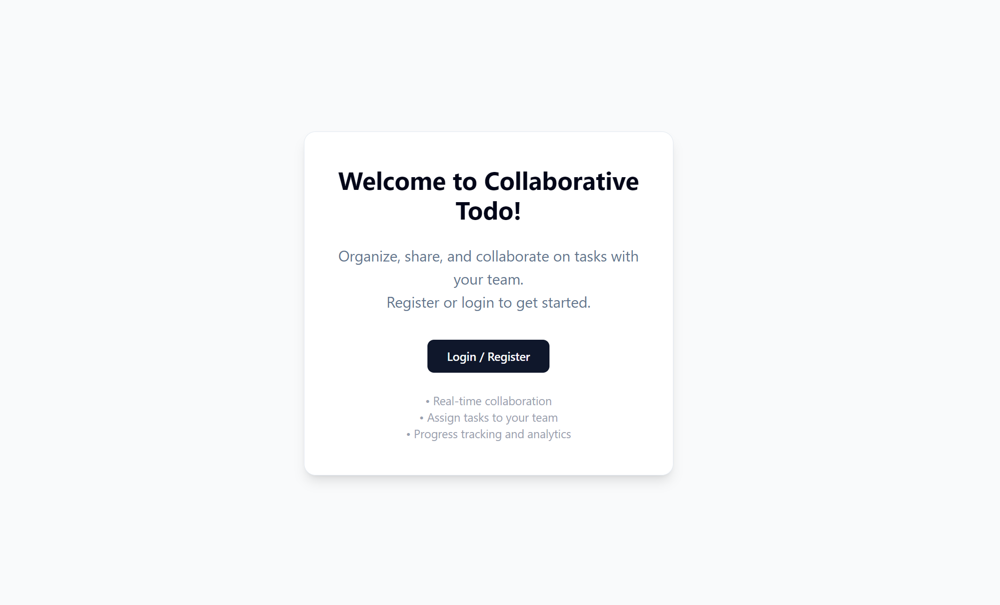
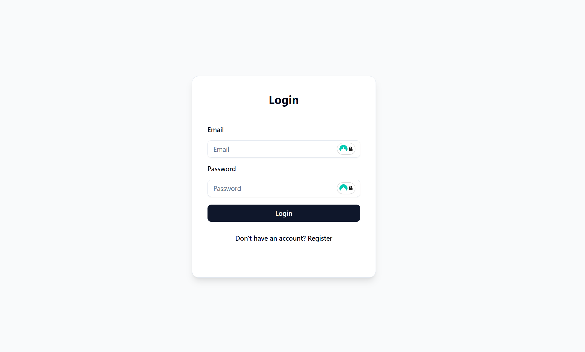

# My Collaborative Todo

**My Collaborative Todo** is a modern, production-minded, full-stack web app for managing personal and collaborative todo lists in real time. The app is designed for multiple users to collaborate seamlessly on shared tasks, assign todos, and track progress together—all with robust authentication and live synchronization.

**Tech Stack & Architecture**  
- **Frontend:** Next.js (TypeScript) — deployed on Vercel  
- **Backend:** Node.js + Express (TypeScript) — deployed on Google Cloud Run  
- **Data & Auth:** Firebase Authentication and Firestore  
- **Monorepo:** `/frontend` for the app, `/backend` for the API

---

## Features

- **Secure user registration & login** (Firebase Authentication)
- **Personal and collaborative todo lists:** Create, update, and delete todos or assign them to other users for shared work
- **Real-time updates** across all devices and users (Firestore-driven synchronization)
- **Robust ownership & permissions:** Todos are only visible/editable to owners and assignees
- **Clean separation of frontend and backend** for easier maintenance and scalability
- **Fully containerized backend** for simple cloud deployment
- **Environment variables** for easy configuration and deployment
- **Scalable project structure** for professional development and team expansion

---

## Screenshots

### Welcome Page

### Login Page

### Dashboard

---

## Project Structure

my-collaborative-todo/  
├── backend/     # Node.js backend (Express API, Dockerfile here)  
├── frontend/    # Next.js frontend (Vercel-ready)

---

## Getting Started Locally

### Backend (API)

cd backend
npm install
npm run dev # Starts Express server on http://localhost:4000

### Frontend (Next.js)

cd frontend
npm install
npm run dev # Starts Next.js on http://localhost:3000

- **Configure API URL:**  
  In `/frontend/.env` (or Vercel dashboard), set:

NEXT*PUBLIC_API_URL=http://localhost:4000
*(for production: use your actual Google Cloud Run backend URL)\_

---

## Deployment

### Backend

- **Google Cloud Run**
- Dockerfile is in `/backend`
- Uses Google Cloud Build, with `cloudbuild.yaml` configured to build from `/backend`
- Create/update builds by pushing changes to `main`

### Frontend

- **Vercel**
- Connect `/frontend` folder as project root
- Set `NEXT_PUBLIC_API_URL` as a Vercel environment variable (use your Cloud Run endpoint in production)
- Automatic builds and deploys on push

---

## Useful Scripts

From `/backend`:

- `npm run dev` — Start backend in development
- `npm run build` — Build for production
- `npm start` — Start backend in production mode

From `/frontend`:

- `npm run dev` — Start Next.js dev server
- `npm run build` — Build Next.js
- `npm start` — Start Next.js production server

---

## Continuous Deployment

- **Backend**: Pushing to `main` triggers Cloud Build → Docker image → deploys to Cloud Run
- **Frontend**: Pushing to `main` deploys via Vercel

---

## Environment Variables

Backend (set on Cloud Run):

- Example: `FIREBASE_KEY`, `NODE_ENV`, etc.

Frontend (set on Vercel):

- `NEXT_PUBLIC_API_URL`: The URL of your backend API

---

## License

[MIT](LICENSE)

---

## Author

[Maxime Dewynter]
